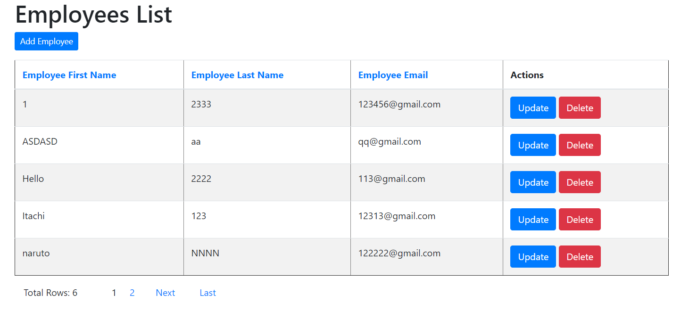
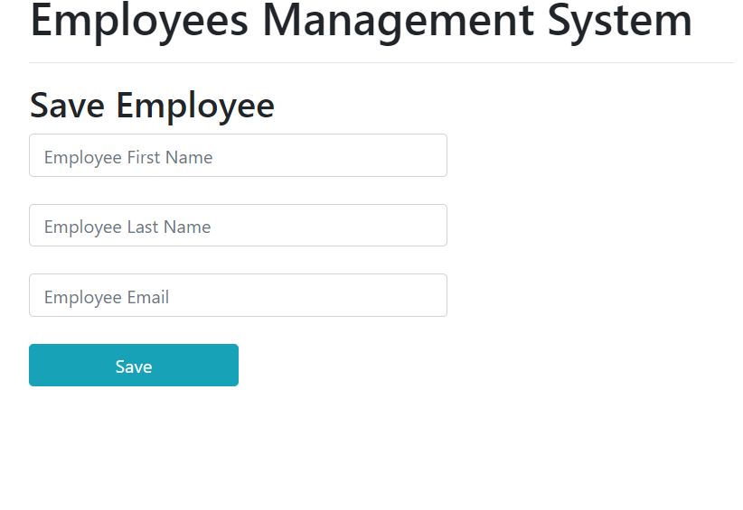
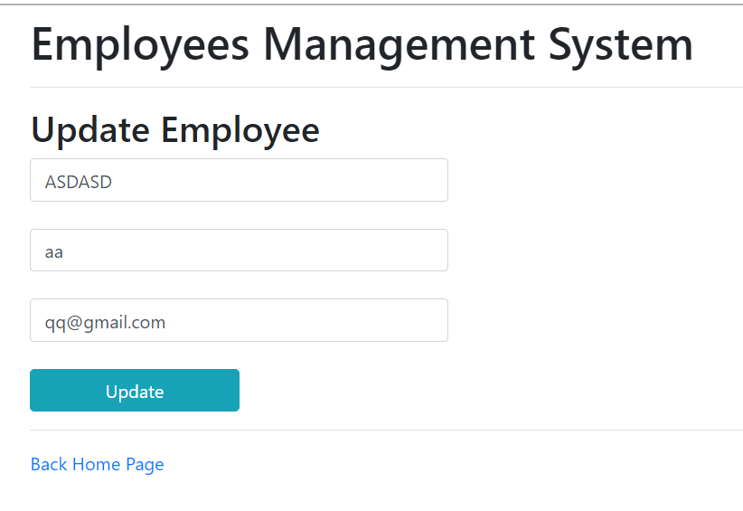

簡單的 Spring boot 實現 CRUD。使用 JPA 以及 thymeleaf 等套件。 

## MySQL
MySQL 使用 Docker 架設

安裝至虛擬機

```shell
sudo docker run --name mysql -p 3306:3306 -v /mnt/mysql-data:/var/lib/mysql -v /mnt/mysql-config:/etc/mysql/conf.d  -e MYSQL_ROOT_PASSWORD=123456 --user 1000:1000 -d mysql:8.0
```
Windows 的 WSL 安裝此套件，以進行遠端

```shell
 sudo apt-get install mysql-client
```
遠端登入 Mysql

```shell
mysql -h localhost -P 3306 --protocol=tcp -u spring -p
```

以下是 MySQL 遠端操作結果

```shell
$ mysql -h 192.168.134.146 -P 3306 --protocol=tcp -u spring -p
Enter password: 
Welcome to the MySQL monitor.  Commands end with ; or \g.
Your MySQL connection id is 93
Server version: 8.0.22 MySQL Community Server - GPL

Copyright (c) 2000, 2020, Oracle and/or its affiliates. All rights reserved.  

Oracle is a registered trademark of Oracle Corporation and/or its
affiliates. Other names may be trademarks of their respective
owners.

Type 'help;' or '\h' for help. Type '\c' to clear the current input statement.

mysql> show tables;
ERROR 1046 (3D000): No database selected
mysql> use demo
Reading table information for completion of table and column names
You can turn off this feature to get a quicker startup with -A

Database changed
mysql> use demo;
Database changed
mysql> show tables;
+----------------+
| Tables_in_demo |
+----------------+
| employees      |
+----------------+
1 row in set (0.01 sec)

mysql> show tables
    -> ;
+----------------+
| Tables_in_demo |
+----------------+
| employees      |
+----------------+
1 row in set (0.01 sec)

mysql> SELECT * FROM employees
    -> ;
+----+-------+----------------------------+-----------+
| id | email | first_name                 | last_name |
+----+-------+----------------------------+-----------+
|  1 | NULL  | Itachi,kevin,123@gmail.com | NULL      |
+----+-------+----------------------------+-----------+
1 row in set (0.01 sec)

mysql> SELECT * FROM employees;
+----+-----------------+------------+-----------+
| id | email           | first_name | last_name |
+----+-----------------+------------+-----------+
|  1 | 22123@gmail.com | Itachi     | kevinCC   |
|  2 | aaa@gmail.com   | Hello      | ASA       |
|  3 | 123@gmail.com   | Itachi     | Kevin     |
|  4 | 123@gmail.com   | Itachi     | Kevinss   |
+----+-----------------+------------+-----------+
4 rows in set (0.00 sec)

mysql> SELECT * FROM employees;
+----+-----------------+------------+-----------+
| id | email           | first_name | last_name |
+----+-----------------+------------+-----------+
|  1 | 22123@gmail.com | Itachi     | kevinCC   |
|  2 | aaa@gmail.com   | Hello      | ASA       |
|  4 | 123@gmail.com   | Itachi     | Kevinss   |
+----+-----------------+------------+-----------+
3 rows in set (0.00 sec)

mysql>
```

這邊雖然有 root，但還是建立一個使用者 spring，創建如下

```shell
create user 'spring'@'%' identified by '123456';
grant all on demo.* to 'spring'@'%'; 
```


##### Home Page


##### Add Employee Page


##### Update Page



## Log 

Spring Boot 內部所有日誌記錄是使用 Commons Logging 實現，同時默認配置也提供了 `Java Util Logging`、`Log4J`、`Log4J2`、`Logback` 的支援。在每種情況下，已預先配置為使用控制台輸出，同時提供檔案輸出方式。

預設情況下，如果使用*Starters*，則使用 Logback 進行日誌記錄。
## 日誌格式
日誌格式

```shell=
2019-03-05 10:57:51.112  INFO 45469 --- [           main] org.apache.catalina.core.StandardEngine  : Starting Servlet Engine: Apache Tomcat/7.0.52
2019-03-05 10:57:51.253  INFO 45469 --- [ost-startStop-1] o.a.c.c.C.[Tomcat].[localhost].[/]       : Initializing Spring embedded WebApplicationContext
2019-03-05 10:57:51.253  INFO 45469 --- [ost-startStop-1] o.s.web.context.ContextLoader            : Root WebApplicationContext: initialization completed in 1358 ms
2019-03-05 10:57:51.698  INFO 45469 --- [ost-startStop-1] o.s.b.c.e.ServletRegistrationBean        : Mapping servlet: 'dispatcherServlet' to [/]
2019-03-05 10:57:51.702  INFO 45469 --- [ost-startStop-1] o.s.b.c.embedded.FilterRegistrationBean  : Mapping filter: 'hiddenHttpMethodFilter' to: [/*]
```

{Date and Time} {Log Level} {Process ID} {\-\-\-} {Thread name} {Logger name} { log message}

>\-\-\- 表示日誌的開始

>Logback does not have a FATAL level. It is mapped to ERROR.


`%logger{length}` 表示如果訊息長度大於給定的 length 的值，保留最右邊的單詞，左邊的每個單詞只保留第一個字符。

日誌訊息對齊與控制

|模式|描述|
|---|---|
|%50logger|靠右對齊，最小寬度為 50，若不足 50 則左補空格，長度超出 50 則原樣輸出|
|%-50logger|`-` 表示向左對齊|
|%.20logger|靠左對齊，最大的寬度為 20，若長度超出 20，將左邊多出的字符直接移除|
|%30.50logger|最小寬度為 30，若長度不足 30 則左補空格靠右對齊；若長度大於 30 且不足 50 則靠左對齊；若長度大於 50 則將左邊多出的字符直接移除|


## 日誌級別
- Trace
- DEBUG
    - 開發階段使用，驗證功能是否正確
- INFO
    - 開發階段使用，驗證開發功能或 bug 是否修正
- WARING
    - 部會對系統造成影響的非正常流程
- ERROR
    - 對系統造成影響的非正常流程，可自我修復，不影響系統穩定性
- CRITICAL
    - 產生不可逆的錯誤，使得系統無法正常工作
- OFF


`application.properties` 配置示例：
```
logging.level.root = WARN
logging.level.org.hibernate.SQL = DEBUG
```
如果以 `logging.level.*`可以是根級別（root）也可以是 `package` 級別。

## 檔案輸出

```
logging.file = logs/logfile.log
logging.path = logs # 指定日誌檔案輸出的目錄
```

透過 `logging.pattern.console` 可以指定日誌輸出的格式，設置如下：
```
logging.pattern.console="%date{yyyy-MM-dd HH:mm:ss} -%5level [%15.15thread] %-40.40logger{39} : %msg%n"
```
日誌參數
|參數|描述|
|---|---|
|%logger|所在 Class 的全名|
|%date|定義日誌輸出的時間格式|
|%msg|錯誤的訊息|
|%level|日誌等級|
|%thread|產生日誌的執行續名稱|
|%n|換行|


## Logback 配置
在 Spring boot 可以使用 Logback 進行配置，系統預設加載日誌配置檔案
- logback-spring.xml
- logback-spring.groovy
- logback.xml
- logback.groovy

為自己的環境配置有兩種方法，如果只是簡單的更改，則可以把屬性添加到 `application.properties` 等配置屬性檔案中，或者對於更複雜的需求，可以使用 `XML` 或 `Groovy` 來指定設置。

在 Maven 環境中我們添加以下屬性
```xml=
        <!-- 整合 fluent         -->
        <dependency>
			<groupId>org.fluentd</groupId>
			<artifactId>fluent-logger</artifactId>
			<version>0.3.4</version>
		</dependency>
        <!-- 主要是這個         -->
		<dependency>
			<groupId>ch.qos.logback</groupId>
			<artifactId>logback-classic</artifactId>
			<version>1.2.3</version>
		</dependency>
		<!-- send to flunted -->
		<dependency>
			<groupId>com.sndyuk</groupId>
			<artifactId>logback-more-appenders</artifactId>
			<version>1.8.0</version>
		</dependency>
        <!-- 配置 Json         -->
		<dependency>
			<groupId>net.logstash.logback</groupId>
			<artifactId>logstash-logback-encoder</artifactId>
			<version>6.6</version>
		</dependency>
```

`logback-classic` 包含 `logback-core` 依賴關係，他們之間有著我們可以配置的屬性。

```xml=
<?xml version="1.0" encoding="UTF-8"?>
<configuration>

  <appender name="STDOUT" class="ch.qos.logback.core.ConsoleAppender">
    <encoder>
      <pattern>
        %d{dd-MM-yyyy HH:mm:ss.SSS} %magenta([%thread]) %highlight(%-5level) %logger{36}.%M - %msg%n
      </pattern>
    </encoder>
  </appender>

  <root level="INFO">
    <appender-ref ref="STDOUT"/>
  </root>

</configuration>
```

建立一個 `ConsoleAppender` 的類，相似於 `System.out.print` 打印數據一樣。該配置設置了日誌輸出的格式，這些表示方式根據已發送到記錄器的訊息替換為生成的值。該格式含有一些符號，如下說明

- %d
    - 日誌訊息觸發的時間
- %thread
    - 日誌訊息的執行續時間
- $-5level
    - 日誌等級
- %logger{36}
    - 輸出發生日誌訊息的 package 和 class，{36} 限制了其長度
- %M 
    - 發生該日誌訊息的方法名稱
    - 會影響效能
- %msg
    - 日誌訊息
- %n
    - 換行
- %magenta()
    - 輸出顏色
- highlight()
    - 設置日誌級別輸出的顏色

如果要在與根級別不同的級別上記錄該 class 的訊息，則可以為該 class 定義自己的記錄器。如下

```xml=
<logger name="com.xxx.service.MyServiceImpl"  additivity="false" level="DEBUG">
  <appender-ref ref="STDOUT" /> <!-- 參照前面所定義的日誌格式 -->
</logger>
```
不使用 `additivity=false` 將導致訊息被打印兩次，原因是根日誌附加程序和類級別附加程序都寫入日誌。


配置將日誌寫入檔案
```xml=
<springProfile name="file">
        <property name="logPath" value="/var/log"/>
        <appender name="fileInfoLog" filePermissions="rw-r--r--" class="ch.qos.logback.core.rolling.RollingFileAppender">
            <encoder class="net.logstash.logback.encoder.LoggingEventCompositeJsonEncoder">
                <providers class="net.logstash.logback.composite.loggingevent.LoggingEventJsonProviders">
                    <pattern>
                        <pattern>
                            {
                                "timestamp": "%date{ISO8601}",
                                "level": "%level",
                                "application": "${springAppName:-}",
                                "trace": "%X{trace_id:-}",
                                "span": "%X{span_id:-}",
                                "trace_flags": "%X{trace_flags:-}",
                                "pid": "${PID:-}",
                                "thread": "%thread",
                                "class": "%logger{40}",
                                "message": "%message"
                            }
                        </pattern>
                    </pattern>
                </providers>
            </encoder>
            <!--滾動策略-->
            <rollingPolicy class="ch.qos.logback.core.rolling.SizeAndTimeBasedRollingPolicy">
                <!--路徑-->
                <fileNamePattern>${logPath}/info.%d{dd-MM-yyyy}_%i.log</fileNamePattern>
                <maxHistory>7</maxHistory>
                <maxFileSize>10MB</maxFileSize>
                <totalSizeCap>100MB</totalSizeCap>
            </rollingPolicy>
        </appender>

        <root level="INFO">
            <appender-ref ref="STDOUT" />
            <appender-ref ref="fileInfoLog" />
        </root>
    </springProfile>
```

[參考資源](https://lankydan.dev/2019/01/09/configuring-logback-with-spring-boot)

### 不同環境配置文件的配置
```xml=
<springProfile name="staging">
	...
</springProfile>

<springProfile name="dev">
	...
</springProfile>

<springProfile name="!prod">
    ...
</springProfile>
```

## 整合 Fluent

## 總結
運行時可接透過 socket 方式將 Log 傳送到 ES，內容使用 Kibana Table dashboard 呈現。
- 使用 Logback 將日誌存成檔案，在由 fluent 讀取
    - IO 較重
    - 檔案的管理
- 使用 Socket 方式
    - 開發時可連接
    - 運行時可連接
